# Glance-SAHI 设计报告：先扫一眼全图，只切可疑区域

> 场景：高清 / 航拍图里找小目标（人、车，可扩展到烟头、火点、违停）
> 基线开源项目：[obss/sahi](https://github.com/obss/sahi) 0.12.7（切片推理）+ [ultralytics](https://github.com/ultralytics/ultralytics) YOLO11s（COCO 预训练，零训练）
> 数据集：[VisDrone2019-DET-val](https://github.com/VisDrone/VisDrone-Dataset)（548 张无人机航拍图，1360×765 ~ 2000×1500）；[DOTA-v1.0 val](https://captain-whu.github.io/DOTA/)（458 张大幅面遥感图，ultralytics 转换版 `DOTAv1.zip`）
> 硬件：RTX 3050 Laptop 4GB
> 报告里所有数字都来自 `results/*.csv`（VisDrone）与 `results/dota/*.csv`（DOTA），由 `scripts/` 下的脚本生成，可复现。

主线：**为什么改 → 改了什么 → 结果如何 → 有什么价值**。

---

## 1. 为什么改

### 1.1 SAHI 做了什么

小目标在整图推理时会被缩没：一张 1920×1080 的航拍图送进 640 输入的 YOLO，要缩小 3 倍，一个 20×20 像素的行人只剩 7×7，基本检测不到。SAHI 的办法是把原图切成 512×512、重叠 20% 的切片，每片单独送进检测器（相当于放大 1.25 倍看），最后把各片结果平移回原图坐标，和一次整图推理（standard prediction，负责大目标）一起做 NMS 合并。

### 1.2 瓶颈：切片数只和图像尺寸有关，和图里有没有东西无关

`sahi.slicing.get_slice_bboxes` 是一个纯几何的双重循环，切片数 N ≈ ⌈W/410⌉·⌈H/410⌉：

| 分辨率 | SAHI 切片数（512，重叠 0.2） | 检测器调用次数（含整图） |
|---|---|---|
| 1360×765 | 8 | 9 |
| 1920×1080 | 15 | 16 |
| 3840×2160（4K） | 60 | 61 |
| 7680×4320（8K） | 209 | 210 |

检测器调用次数随像素面积线性增长，对航拍图来说大量切片落在天空、屋顶、农田、空旷路面上，**这些切片推理完什么都不产出，算力白花了**。

实测（VisDrone-val，`run_eval.py sim` 输出）：SAHI 的 4275 个切片中，**不含任何 person/vehicle 真值目标中心的切片有 305 个，占 7.1%**；只看小目标（< 32²），不含小目标的切片占 23.8%（Oracle 只需 76.2% 的切片就能覆盖全部小目标）。VisDrone 是城市街道场景、平均每张图 57 个目标，已经是对我们最不利的情况；在大幅面遥感图（DOTA，见 3.7）上，这个比例会高得多。

### 1.3 灵感

人眼只有视线正中约 2° 是清楚的，外周是模糊的。我们不会把视野逐格看清，而是先粗看全局，看到"那里好像有东西"再把视线跳过去（扫视）。本项目把这套思路落到 SAHI 上：**先用缩小的整图"扫一眼"，再只对可疑区域切片放大看**。

---

## 2. 改了什么

### 2.1 流程对比

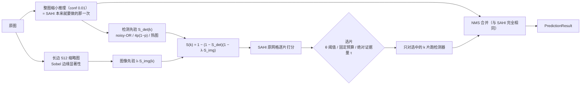

（上图是 mermaid 纯文本，可 diff、可版本管理；SAHI 侧对应“生成 N 片 → N 片逐一推理 → 整图推理一次 → NMS 合并”。）

关键设计：**只改“选哪些切片”，其余一律复用 SAHI**。切片网格用 `sahi.slicing.get_slice_bboxes`，单片推理用 `sahi.predict.get_prediction(shift_amount, full_shape)`，合并用 `sahi.predict.POSTPROCESS_NAME_TO_CLASS`。因此：
- 阈值 θ = 0（全选）时，结果与官方 `get_sliced_prediction` 逐框一致（`run_eval.py e2e --check-all` 自检）；
- 返回的是 SAHI 原生的 `PredictionResult`，下游可视化、导出、COCO 评测代码不用改；
- 对检测器没有任何要求，换成 RT-DETR、换成自己训练的 VisDrone 模型都能直接用。

### 2.2 切片打分

对第 k 个切片 R_k 计算一个“这里值得细看”的分数 S_k ∈ [0, 1]，由两路证据组成（`glance_sahi/saliency.py`）。

**检测先验（主证据）**。扫视阶段整图推理在低阈值（0.01）下给出一批粗检测，每个检测 j 的置信度 c_j 可近似看作“这个位置有目标”的概率。切片里“至少有一个目标”的概率按 noisy-OR 计算：

    S_det(k) = 1 − Π_{j: 中心 ∈ R_k ⊕ margin} (1 − c_j)

- 为什么放低阈值：缩小后的小目标置信度通常只有 0.01–0.1，作为最终输出是误检，但作为“这里可能有东西”的线索很有价值；
- 为什么用 noisy-OR 而不是取最大：一个 0.3 的框和二十个 0.05 的框（密集的小人群）应该都能触发细看，noisy-OR 能累积弱证据（1 − 0.95²⁰ ≈ 0.64）；
- margin = 16 像素：目标中心落在切片边缘附近时也算，配合 SAHI 的 20% 重叠。

**形式化：S_det 就是“切片含目标”的后验概率。** 记第 k 片是否含目标的指示变量 Y_k ∈ {0,1}，把扫视阶段的每个粗检测 j 看成一次独立观测 E_j，其可靠度 P(E_j | 该处有目标) ≈ c_j，无目标处的误报率在同一尺度下近似为 0，则

    S_det(k) = P(Y_k = 1 | E_{1..m}) = 1 − Π_{j ∈ J_k} (1 − c_j),   J_k = { j : 中心_j ∈ R_k ⊕ margin }

这是把概率陈述直接搬进模型：**θ 不是启发式加权拍出来的阈值，而是后验概率阈值**；扫 θ 得到的不是一条曲线，而是一族“速度-精度”工作点（论文主图，图 1、图 2）。“图越大越省”也因此有了可检验的表述：空切片比例上升 ⟹ 同一 θ 下 k/N 下降（VisDrone 7.1% 空切片、DOTA 82.1%，见 3.7）。两点假设需要说明：一是各证据近似独立（重叠框会重复计数，但 NMS 后同一目标只留一个框）；二是 c_j 只在序关系上可靠（检测器未在缩略图尺度上标定），因此用相对阈值 θ 而非绝对判据。

**证据强度 w_j 的四种取法（打分函数消融，`det_weights`）。**

| 变体 | 片内证据强度 w_j | 聚合方式 | 直觉 / 代价 | 配置 |
|---|---|---|---|---|
| v0（反面消融） | c_j | 取最大 | “最像目标的那个框说了算”，置信度越高越热；密集区域被压平 | `det_prior="max"` |
| 不确定度加权 | 4c_j(1−c_j) | noisy-OR | c ≈ 0.5 的“似是而非”框最热，整图已看清的地方变冷 | `det_prior="uncertain"` |
| **本文（默认）** | c_j | noisy-OR | 弱证据可累积，c_j 直接就是概率 | `det_prior="noisyor"` |
| 热图 | c_j（按高斯软扩散） | 1 − exp(−Σ heat) | O(像素) 一次卷积、无硬边界、分数是绝对量 | `det_prior="heatmap"` |

四种取法共用一个接口，可在一份缓存上离线对比（`run_eval.py sim` 的 `ABLATIONS`）；设计动机和参照数据见 3.8，热图与绝对量 τ 的形式化见 3.9，曲线图 `results/figures/fig6_det_weights.png` 由 `make_figures.py` 生成。

**图像先验（兜底证据）**。缩小后检测器完全没反应的极小目标，在缩略图上往往仍然表现为局部高频纹理。在长边 512 的灰度缩略图上计算：

    mag = |∇I|（Sobel）,  sal = max(blur₅(mag) − blur₃₁(mag), 0) + 0.5·blur₅(mag)

前一项是“比周围更杂”（抑制大片均匀纹理如草地、屋顶），后一项是“本身就杂”。按全图 5%/99% 分位归一化到 [0,1]，切片内取 95 分位得到 S_img(k)。另实现了谱残差显著性（Hou & Zhang, 2007）作消融对比。

**融合**（同样是 noisy-OR，λ 为图像先验的可信度）：

    S(k) = 1 − (1 − S_det(k)) · (1 − λ·S_img(k)),   λ = 0.3

**选片**：只有分数够高的切片才做高清推理（`glance_sahi/selector.py`），三种规则对应两个旋钮：

- `mode="threshold"`：S(k) ≥ θ。θ 作用在 [0,1] 的相对分数上，扫 θ 得到一族速度-精度工作点（本文默认）；
- `mode="budget"`：固定保留分数最高的 x%（部署时怕超时的兜底）；
- `mode="evidence"`：片内**绝对**证据量 Σc_j ≥ τ。它不需要任何归一化，因此可跨图、甚至跨数据集统一标定，不受 λ 改动导致整体漂移的影响（这正是 3.7 里 DOTA 上必须重标 λ 的那个痛点的正面解法）。

另有 `min_slices`：选中数不足时按分数补齐，避免“阈值一高一片不剩”的退化（默认 0 = 关闭，保持既有结果不变；`evidence` 模式自动至少保 1 片）。

### 2.3 成本

| 环节 | SAHI | Glance-SAHI |
|---|---|---|
| 整图推理 | 1 次 | 1 次（同一次，只是阈值更低） |
| 检测先验打分 | — | noisy-OR / 4p(1−p)：< 0.1 ms/图（逐片向量化，与框数、切片数几乎无关）；热图变体：一次卷积 |
| 图像先验打分 | — | 缩略图 Sobel + N 个切片求分位：实测 9.9 ms/图（CPU，未优化） |
| 切片推理 | N 次 | k 次（每片实测 23.6 ms，RTX 3050） |
| 合并 | NMS | NMS（输入更少，更快） |

也就是说，只要每图少跑 1 片（≈ 24 ms），就能抵消图像先验的开销（≈ 10 ms）；检测先验本身几乎零成本。

**每一行成本都单独计量进表**：`run_eval.py sim` 的 `sweep.csv` 里除了总耗时 `ms_per_img`，还有一列 `ms_extra` 只记“打分”这一步。图像先验在 DOTA 上是 10–36 ms/图的真实成本，进表比只在正文写一句更有说服力，也方便把“省下的推理”与“新增的打分”分开算账。

### 2.4 与已有工作的区别（不宣称首创“只切可疑区域”）

“先粗看、再只细看可疑区域”是航拍小目标检测里一条成熟的思路，下面的开源项目我们都逐个核对过仓库与论文（GitHub 链接均可访问）：

| 方法 | 年份/会议 | 代码 | 怎么决定细看哪里 | 额外训练？ | 我们借鉴了什么 / 区别在哪 |
|---|---|---|---|---|---|
| SAHI | ICIP 2022 | [obss/sahi](https://github.com/obss/sahi) | 均匀网格，全部切片 | 否 | **基线**。直接复用它的 `get_slice_bboxes` / `get_prediction` / 后处理，只在“生成切片”和“逐片推理”之间插入选片 |
| ClusDet | ICCV 2019 | [fyangneil/Clustered-Object-Detection-in-Aerial-Image](https://github.com/fyangneil/Clustered-Object-Detection-in-Aerial-Image) | 训练 CPNet 预测目标聚集区域 + ScaleNet 估尺度 | 是 | 证明“粗阶段找聚集区域”可行；我们用免训练的打分代替 CPNet |
| DMNet | CVPRW 2020 | [Cli98/DMNet](https://github.com/Cli98/DMNet) | 训练 MCNN 密度图，滑窗内密度求和 ≥ 阈值则裁剪 | 是 | 借鉴“窗口内证据累加再设阈值”，我们的 noisy-OR 分数相当于一张免训练的伪密度 |
| GLSAN | TIP 2021 | [dengsutao/glsan](https://github.com/dengsutao/glsan) | 全局粗检后，SARSA 按检测框聚类裁出密集区 | 裁剪本身无监督，检测/超分需训练 | 与我们最接近的“基于粗检测框选区域”，但它裁自由形状的区域、还要超分；我们固定在 SAHI 网格上选片，可直接替换 |
| QueryDet | CVPR 2022 | [ChenhongyiYang/QueryDet-PyTorch](https://github.com/ChenhongyiYang/QueryDet-PyTorch) | 低分辨率特征上预测小目标粗位置，只在对应高分辨率位置做稀疏检测 | 是 | “低分辨率一瞥引导高分辨率计算”的理论支撑；它在特征层做，我们在图像层做、对检测器零改动 |
| UFPMP-Det | AAAI 2022 | [PuAnysh/UFPMP-Det](https://github.com/PuAnysh/UFPMP-Det) | 粗检测器给前景区域，拼成马赛克图一次精检 | 是 | 后续可借鉴：把选中的切片拼图/打 batch 进一步降延迟 |
| CZDet | CVPRW 2023 | [akhilpm/DroneDetectron2](https://github.com/akhilpm/DroneDetectron2) | 把“密集裁剪框”当成新类别让检测器一起检出，再放大重检 | 是 | 同样在 VisDrone/DOTA 上验证两阶段级联 |
| YOLC | TITS 2024 | [dawn-ech/YOLC](https://github.com/dawn-ech/YOLC) | 热图上取 top-k 聚集区域放大 | 是 | 借鉴其“固定预算 top-k”——我们的 `mode="budget"` |
| ESOD | TIP 2024 | [alibaba/esod](https://github.com/alibaba/esod) | ObjSeeker 在特征图上找目标，AdaSlicer 丢背景块 | 是 | 借鉴其“空块率 / 漏检率”指标 → 我们的“空切片比例 / 小目标覆盖率” |
| GOIS | Neurocomputing 2025 | [MMUZAMMUL/GOIS](https://github.com/MMUZAMMUL/GOIS) | 粗切片扫一遍找 ROI，再在 ROI 上用更细切片精检 | 否 | 目标是**提精度**（多跑细切片）；我们目标是**省算力**（少跑切片），方向相反但可叠加 |
| ASAHI | Remote Sensing 2023 | 未找到官方代码 | 按分辨率自适应切片**数量**，仍是均匀覆盖 | 否 | 与内容无关，可与我们的按内容选片叠加 |
| ROI-Gated SAHI | arXiv 2608.23923（2026-08） | 论文未给出代码 | 另一个轻量检测器在 416 缩略图上出 ROI，只跑与 ROI 相交的切片；ROI 覆盖率高时回退全量 SAHI | 否 | **与本项目思路最接近的同期工作**，区别见下 |

**与 ROI-Gated SAHI 的区别**（它的论文在 COCO128 上报告：平均速度只有全量 SAHI 的 0.88×，mAP50 从 0.757 掉到 0.660；加自适应回退后也只有 1.02×）：

1. **不额外加模型**：它要一个单独的 proposer（YOLOv8n），多一次推理；我们的“扫视”就是 SAHI 本来就要做的整图推理（`perform_standard_pred`），只是把阈值放低，开销≈0；
2. **软打分而不是硬 ROI**：它把 proposer 的框 NMS 后扩 15% 当 ROI，只要和切片相交就跑；我们用 0.01 的极低阈值拿到所有弱响应，用 noisy-OR 累积成“切片里有目标的概率”，再用图像显著性兜底，θ 连续可调，自然覆盖“稀疏→密集”的全部区间，不需要单独的回退开关；
3. **评测更严格**：大规模航拍数据集（VisDrone 548 张、DOTA 458 张）、**同数量随机选片对照**、Oracle 上界、与官方 `get_sliced_prediction` 逐位一致的自检。在这套评测下，我们在同等精度下是真正更快的（见第 3 节），而不只在个别稀疏样例上更快。

我们的定位是工程上最轻的一种：不训练、不改检测器、不读模型内部、不加第二个模型，黑盒检测器即可，一行替换 `get_sliced_prediction`。

---

## 3. 结果如何

### 3.1 实验设置

- 检测器：YOLO11s COCO 预训练（未在 VisDrone 上训练），输入 640，输出阈值 0.05；
- 评测类别：person ← VisDrone 的 pedestrian + people；vehicle ← car + van + truck + bus（COCO 能对上的类别）；忽略区域和 others 记为 crowd，落在里面的检测不算误检；
- 指标：pycocotools COCO AP、AP50、AP_small（面积 < 32²，VisDrone 中 31009 个有效目标里 66.5% 是小目标），maxDets = 500；另记录“小目标覆盖率” = 中心落在被选切片内的小目标真值比例（解释漏检来自哪里）；
- 所有方法共用同一个检测器、同一套切片网格（512，重叠 0.2）、同一个后处理（NMS，IoU 0.5）；
- 为保证扫参可复现且公平，`run_eval.py cache` 对每张图只跑一遍“扫视 + 全部切片”并缓存每片结果与耗时；任何选片策略的结果 = 扫视结果 + 被选切片的结果 → 同一个 NMS，可离线精确复现。端到端真实计时另由 `run_eval.py e2e` 给出，并用来核对离线结果。

### 3.2 主结果（VisDrone2019-DET-val，548 张）

离线模拟（`results/sweep.csv`，同一份缓存，耗时 = 扫视 + 被选切片 + 打分 + NMS 的实测耗时之和）：

| 方法 | 切片数/图 | 相对 SAHI 切片 | ms/图 | AP | AP50 | AP_small | 小目标覆盖率 |
|---|---|---|---|---|---|---|---|
| 整图直接推理 | 0 | 0% | 44.8 | 20.03 | 34.87 | 9.30 | — |
| SAHI 均匀切片 | 7.80 | 100% | 215.0 | **28.40** | **48.95** | **17.88** | 100% |
| **Glance-SAHI（θ=0.9，默认工作点）** | 6.16 | **79.0%** | 189.6 | 28.27 | 48.69 | 17.75 | 95.8% |
| Glance-SAHI（θ=0.99，激进） | 4.90 | **62.9%** | 147.3 | 27.90 | 48.09 | 17.46 | 92.6% |
| Glance-SAHI 仅检测先验（θ=0.99） | 4.80 | 61.5% | 133.1 | 27.82 | 48.05 | 17.39 | 92.2% |
| 随机选同样数量切片（θ=0.9 对应，3 次均值） | 6.16 | 79.0% | 179.6 | 27.58 ± 0.05 | 47.54 | 16.96 ± 0.03 | 91.1% |
| 随机选同样数量切片（θ=0.99 对应） | 4.90 | 62.9% | 147.1 | 26.64 ± 0.06 | 46.37 | 16.03 ± 0.08 | 82.9% |
| Oracle（按真值小目标选片，上界，不可部署） | 5.95 | 76.2% | 177.1 | 28.54 | 49.50 | 18.15 | 100% |

端到端真实运行（`run_eval.py e2e --op 0.9 --check-all`，`results/e2e.csv`，真实调用官方 `get_sliced_prediction` 和我们的 `glance_sliced_prediction`）：

| 方法 | ms/图 | FPS | 切片数/图 | AP | AP_small |
|---|---|---|---|---|---|
| 整图 | 30.5 | 32.8 | 0 | 20.18 | 9.31 |
| 官方 SAHI `get_sliced_prediction` | 231.2 | 4.33 | 7.80 | 28.40 | 17.88 |
| Glance-SAHI（θ=0.9） | **203.5** | **4.91** | 6.16 | 28.27 | 17.75 |
| 自检：Glance-SAHI 强制全选 | 230.4 | 4.34 | 7.80 | 28.40 | 17.88 |

- **正确性自检通过**：强制全选时 AP/AP50/AP_small 与官方 SAHI 逐位一致（28.3956 / 48.9476 / 17.8811），说明我们只改了选片，切片、推理、合并与 SAHI 完全等价；
- 端到端与离线模拟的 AP 完全一致（28.27 / 17.75），离线扫参结果可信；
- 在 VisDrone 这种**密集城市场景**上，默认工作点省掉 21% 的切片、提速 12%，AP 只掉 0.13 个点；激进工作点省掉 37% 的切片、提速 31%（离线），AP 掉 0.5 个点。

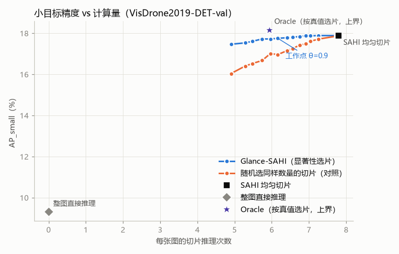
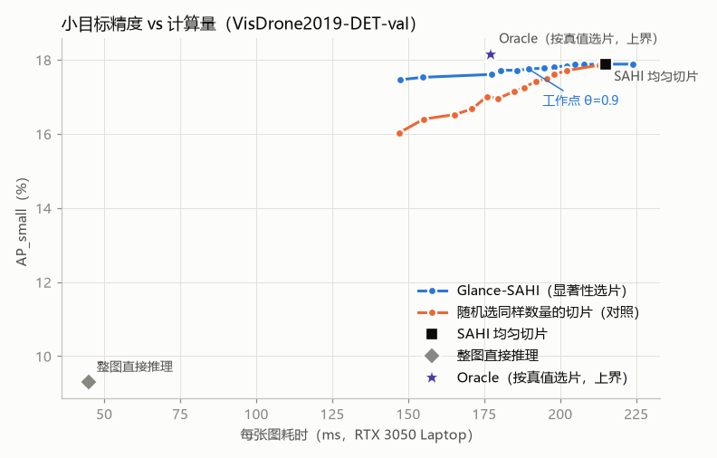

### 3.3 随机对照：省下的是“对的”切片

如果只是“少跑点切片精度就掉一点”，那随便扔掉一些切片也行。随机对照回答这个问题：每张图随机选**和 Glance 同样数量**的切片（3 个随机种子）。

- 同样跑 79% 的切片：Glance AP_small 17.75，随机 16.96 ± 0.03，**Glance 保住了 SAHI 相对整图提升（+8.58）的 98.5%，随机只保住 89.3%**；
- 同样跑 63% 的切片：Glance 17.46 vs 随机 16.03，差距拉大到 1.4 个点；小目标覆盖率 92.6% vs 82.9%；
- 在全部 13 个阈值上，Glance 曲线都严格在随机曲线之上（图 1），且差距随切片预算收紧而扩大——说明分数的**排序**是有信息的，被扔掉的确实是空切片。

### 3.4 消融：哪路证据在起作用

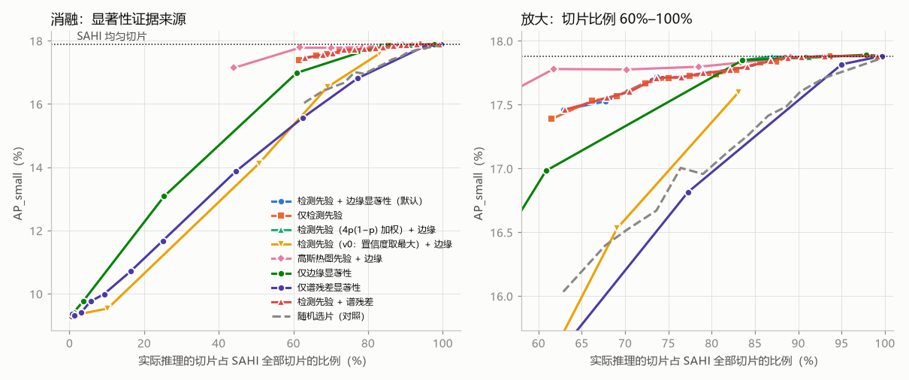

- **检测先验是主力**：仅检测先验与“检测 + 边缘”几乎重合（θ=0.9：17.73 vs 17.75），在 60%–100% 区间全面领先随机；而且几乎零成本（不用算缩略图），对延迟最敏感的场景可以只用它（θ=0.99 时 133 ms/图，比 SAHI 快 38%）；
- **图像先验单用不可靠，但有“兜底”价值**：边缘显著性在 84% 切片预算时 AP_small 17.85，几乎无损；但阈值一高就崩（θ=0.7 只剩 25% 切片，AP_small 13.1）——纹理丰富不等于有目标（屋顶、树冠、斑马线纹理都很强）。谱残差更弱，甚至略低于随机（77% 切片时 16.81 vs 随机 79% 切片时 16.96）；
- **融合的收益很小但稳定**：加上边缘先验后，同阈值下多选约 1.5% 切片，小目标覆盖率 +0.3~0.4 个点，主要补回检测器在缩略图上完全没有反应的极小目标。在 VisDrone 上这点收益勉强抵得上 10 ms 的计算开销，因此我们把它保留为默认值，同时在配置里提供 `img_weight=0` 的纯检测先验模式。
- **检测先验内部的加权方式（新增消融）**：把 `det_prior` 换成 `uncertain`（4p(1−p) 加权）或 `max`（v0 的取最大）重跑 `sim`，即可得到三条曲线（`results/figures/fig6_det_weights.png`）。同一份缓存、同一套网格下，三条曲线的差异完全来自“同一批粗检测怎么加权”，是最干净的一次消融；设计动机与参照数据见 3.8。

### 3.5 自适应：图越空，省得越多

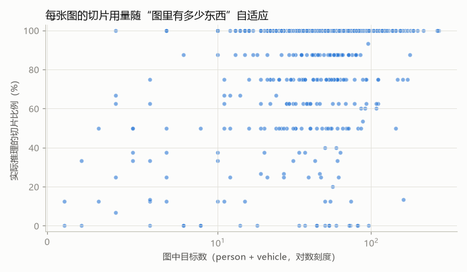

SAHI 每张图的切片数是固定的；Glance-SAHI 按内容变化（θ=0.9）：

| 图中目标数 | 图数 | 平均切片比例 |
|---|---|---|
| < 20 | 78 | **57.0%** |
| 20–50 | 182 | 82.2% |
| 50–100 | 235 | 86.0% |
| ≥ 100 | 53 | 92.7% |

548 张图中有 22 张一片都不用切（只剩一次整图推理），312 张全切（目标遍布全图，本就该全切）。**省下来的算力来自“空”的图和图里“空”的区域**，这正是我们想要的行为：真正密集的地方不省，稀疏的地方大幅省。

**只报桶内切片比例还不够，要报桶内精度。** `run_eval.py buckets` 把同一批图按目标数分桶后，**对每个桶分别跑一次 COCO 评测**（`results/buckets.csv`，图 `fig7_buckets.png` 由 `make_figures.py` 生成）：桶内的切片比例、AP、AP_small、小目标覆盖率，逐桶与 SAHI 和同数量随机对照。这样“稀疏图上省得多、精度掉得少；密集图上不省”才是可验证的断言，而不是只看一个总量平均值。

### 3.6 典型案例（含失败案例）

`scripts/visualize.py` 输出三联图（注意：仓库里现存的 `results/vis/compare_*.jpg` 是旧版两联图，没有热图那一栏，需要重跑 `python scripts/visualize.py --op 0.9` 才会更新）：**左** SAHI 全部切片；**中** Glance-SAHI 选中的切片（橙框，未推理的切片整体压暗，一眼看出“跳过了什么”）；**右** 粗检热图（JET，越红 = 该处附近弱检测置信度之和越大，橙框 = 被选中细看的切片）。第三张是解释方法的关键证据——它把“为什么看这里”直接画出来了（`scripts/visualize.py`）。

**成功：街景，天空和树冠被跳过（15 片 → 4 片，278 → 111 ms）**。上半幅是天空和楼宇，扫视阶段没有任何可疑响应；车和行人集中在中下部的道路上，4 个被选切片覆盖了道路上的绝大部分目标（输出框 49 → 44，少掉的是右侧边缘的零星低置信度框）。
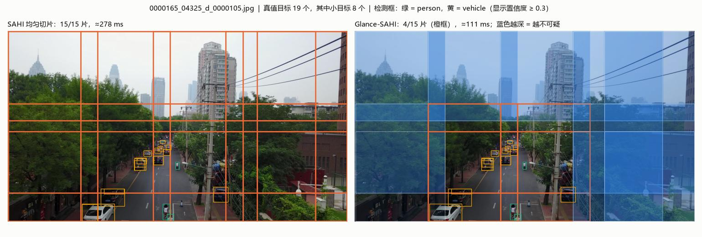

**典型：目标遍布全图，全切（8/8 片）**。这类图 Glance-SAHI 退化为 SAHI，多了约 10 ms 打分开销——这是方法的固有代价。
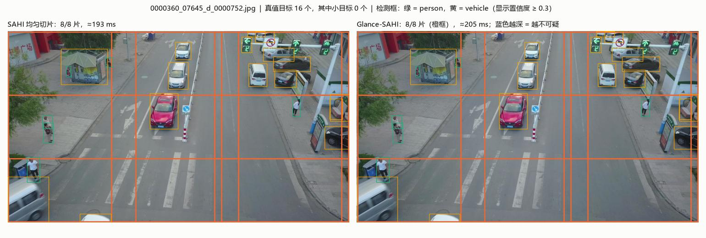

**失败：斜视大场景，漏掉右侧广场上的远处小目标（15 片 → 5 片，输出框 180 → 123）**。右侧广场上的碰碰车、远处行人在缩略图上只有几个像素，检测器给出的置信度接近 0，而大面积均匀的地砖又让边缘显著性很低——两路证据同时失效。这类“低对比度 + 远距离”的目标是扫视策略的盲区，也是 3.2 中 AP 损失的来源之一（默认工作点下小目标覆盖率 95.8%，约 4% 的小目标所在切片没被选中）。
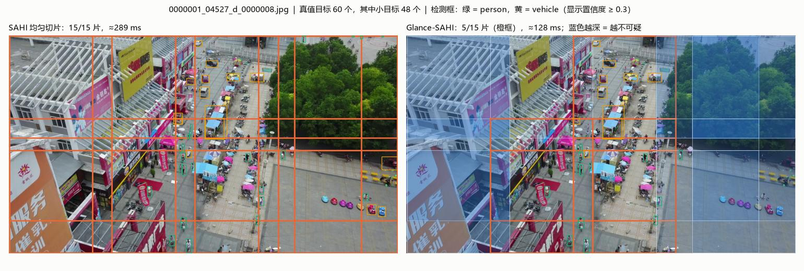

### 3.7 大幅面遥感图：DOTA-v1.0 val（458 张，中位 1706×1872，最大 4000+）

为了验证“图越大越空、省得越多”，我们在 DOTA-v1.0 验证集上重复整套实验（`run_eval.py cache/sim --dataset dota`，结果在 `results/dota/`）。评测类别取 COCO 能对上的三类：vehicle ← small/large vehicle，ship ← ship，plane ← plane，共 21316 个目标，40.2% 为小目标。

**为什么改在这里更明显**：DOTA 每张图平均要切 **44.7 片**（VisDrone 只有 7.8 片），SAHI 单图 1.30 s；而 SAHI 的 20480 个切片中 **82.1% 不含任何目标**，只跑有目标的切片（Oracle）只需 17.9% 的切片。

**先如实说明一个问题**：COCO 预训练的 YOLO11s 基本认不出俯视遥感图里的车和船——即使全量 SAHI，AP 也只有 2.5（AP50 8.3）。这对选片有两个后果：

1. 检测先验在这里失效：缩略图上的扫视几乎没有响应，“检测先验”打出来的分数全部很低，θ 稍高就一片不剩（θ=0.3 只剩 3.4% 切片、覆盖 14.5% 的目标）。这说明**检测先验的质量取决于检测器本身**；换一个在遥感数据上训练过的检测器，这一路才会重新有效；
2. 因此 DOTA 上起作用的是**图像先验**，它不依赖检测器。这正是我们设计两路证据的原因：检测器“看不懂”的时候，图像先验可以兜底。

由于 AP 受检测器太弱的影响、噪声大，我们同时报告一个**与检测器无关**的选片指标：被选切片覆盖了多少真值目标（覆盖不到的目标，后面检测器再强也找不回来）。

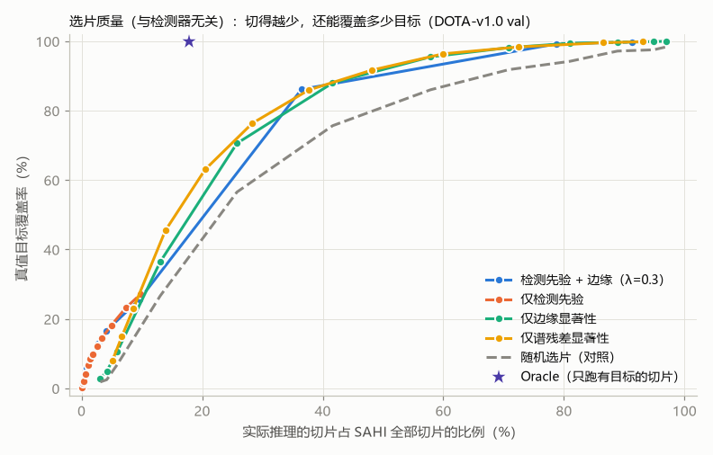

| 选片方式（DOTA） | 切片比例 | 目标覆盖率 | 小目标覆盖率 | ms/图 | AP | AP50 |
|---|---|---|---|---|---|---|
| SAHI 均匀切片 | 100% | 100% | 100% | 1297 | 2.53 | 8.27 |
| 仅边缘显著性 θ=0.3 | 80.9% | 99.4% | 99.3% | 1131 | 2.58 | 8.31 |
| **仅边缘显著性 θ=0.4** | **70.9%** | **98.2%** | 98.4% | 998 | **2.61** | 8.14 |
| 仅边缘显著性 θ=0.5 | 57.9% | 95.5% | 96.5% | 837 | 2.61 | 7.89 |
| 随机选同样数量（对应 θ=0.5，3 次均值） | 57.9% | 86.0% | 88.5% | — | 2.09 ± 0.09 | 6.70 |
| 仅边缘显著性 θ=0.6 | 41.6% | 88.0% | 90.3% | 639 | 2.26 | 6.68 |
| 随机选同样数量（对应 θ=0.6） | 41.6% | 75.7% | 79.2% | — | 2.04 ± 0.06 | 5.84 |
| Oracle（只跑含目标的切片） | 17.9% | 100% | 100% | — | — | — |

- **省 29%–42% 切片，AP 不降反而略升**（θ=0.4/0.5：2.61 vs 2.53）：跳过的空切片（跑道、草地、水面、屋顶）在 SAHI 里只贡献误检；
- **同样切片数下，覆盖率比随机高 9–13 个点**（θ=0.5：95.5% vs 86.0%；θ=0.6：88.0% vs 75.7%），AP 也高出 0.2–0.5（相对 +10%–25%）；
- 谱残差在 DOTA 上与边缘显著性相当，甚至在低切片比例处略好（覆盖率曲线在图中最上方）；它在 VisDrone 上表现差，说明图像先验的具体选择与场景有关；
- 与 Oracle（17.9%）相比仍有很大差距，说明大图上还有很大的节省空间，关键在于有一个“看得懂”这类场景的扫视检测器（见第 4 节后续工作）。

**案例（P0179，机场，132 → 66 片，3.6 s → 2.0 s，输出框 227 → 214）**：跑道、滑行道和大片草地被跳过（深蓝），停机坪上的飞机和停车场的车都在被选切片里。
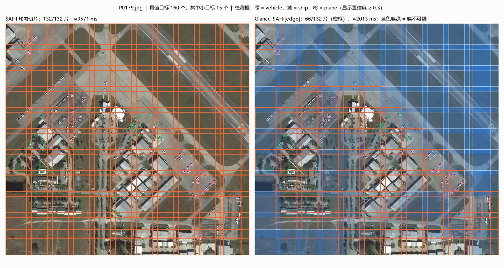

**图像先验权重 λ 的敏感性（`results/dota/lambda.csv`）**：默认的 λ=0.3 是在 VisDrone 上定的（检测先验可靠，图像先验只是兜底）；在 DOTA 上检测先验失效，λ=0.3 的融合分数被压得很低，θ=0.5 时只剩 2.7% 切片；把 λ 调到 1.0，θ=0.5 时回到 59% 切片、小目标覆盖率 97.7%、AP 2.60，与“仅边缘显著性”一致。**λ 表达的是“这个场景下更信哪一路证据”，换检测器、换场景时需要标定一次**——这是本方法的一个真实局限，我们在第 4 节如实列出。

### 3.8 打分函数为什么这么设计：一次失败诊断（v0 → v1 → 本项目）

3.4 说明了两路证据各自的作用，但没有回答“证据该怎么加权”。这一节补上这一段方法论：一条**先失败、再诊断、后修正、并在留出集上验证**的路径。

最初的版本（记作 v0）按最直觉的方式打分：**置信度加权 + 逐像素取最大**。在 VisDrone 上评测后发现，**40% 预算下 AP50 只有 0.389，比随机选片（0.393）还低**——直觉输给了瞎猜。于是分三步诊断（脚本与数据归档在 `results/legacy_saliency_sahi/`）。

**第一步：先确认到底有没有可省的空间。** 把 4275 个切片逐个单独加回“整图结果”，统计每片**真正多找到了几个真值目标**（切片增益）：

| 指标（VisDrone，4275 片） | 数值 |
|---|---|
| 增益为 0 的切片占比 | 35.5% |
| “先知”按真实增益取前 40% 切片，能拿到的总增益 | 80.3% |
| 随机取前 40% 切片 | 49.6% |

空间确实存在：事先知道答案时，四成切片就能拿到八成增益，随机只有一半。

**第二步：哪种廉价信号能把好切片排到前面。** 用每个信号选前 40% 的切片，看能拿到多少总增益：

| 信号 | 前 40% 切片拿到的增益 | 图内秩相关（Spearman） |
|---|---|---|
| 先知（真实增益，上界） | 80.3% | — |
| 整图检测**个数**（片内有几个框） | **73.6%** | 0.59 |
| 边缘密度 | 58.5% | 0.18 |
| 随机 | 49.6% | ≈ 0 |

**结论：好信号是“数量/密度”，不是“置信度高低”。** 而 v0 恰好把两件事都做反了：逐像素取最大把“30 辆车的区域”和“1 辆车的区域”看成一样热；按置信度加权又把整图**已经确定检出**的大目标排到前面，而那些目标本来就不需要再切片。

**第三步：改方法，并在留出集上验证。** 修正版（v1）改了两处——热图**叠加**而非取最大（变成密度图），以及用**不确定度 4p(1−p)** 加权（让 c ≈ 0.5 的“似是而非”框最热，已确定的框变冷）。调参只在奇数编号的 274 张图上做（24 组配置），在偶数编号的 274 张留出图上验证：

| 40% 预算 | 调参集 AP50 | 留出集 AP50 | 留出集 AP50_small |
|---|---|---|---|
| v0：置信度 + 取最大 | 0.396 | 0.388 | 0.295 |
| v1：不确定度 4p(1−p) + 叠加 | 0.405 | **0.403** | **0.314** |

留出集上的提升与调参集一致（AP50 +0.015，小目标 AP50 +0.019），说明不是过拟合。

**这个诊断如何落到本项目（Glance-SAHI）：**

1. “**数量/密度**才是好信号”这一条直接支持 noisy-OR：`1 − Π(1 − c_j)` 正是把“片内有几个框、各自多可信”变成一个概率——20 个 0.05 的弱框累积到 0.64，而取最大只能得到 0.05。这也解释了 2.2 里为什么要在 **0.01 的极低阈值**下取扫视框：弱响应单看是误检，累积起来是有用证据（`tests/test_core.py::test_noisy_or_detection_prior_accumulates_weak_evidence` 固化了这个性质）；
2. v0 的“置信度 + 取最大”保留为**反面消融** `det_prior="max"`，v1 的不确定度加权保留为**可选变体** `det_prior="uncertain"`，与默认的 `"noisyor"` 在同一份缓存上离线对比（3.4）；
3. 与 v1 的一个**有意差异**：本项目默认用 noisy-OR + 置信度，而不是 4p(1−p)。因为 noisy-OR 下 S(k) 就是“切片含目标的后验概率”，θ 有明确的概率含义（2.2）；而 4p(1−p) 的分数只是排序用的启发式，没有概率解释。代价是它可能更贴合“值得再看一眼”的直觉——所以它留作消融变体：主方法可解释，消融表完整。

**数据来源与适用范围（如实说明）**：本节两张诊断表与 v0/v1 对比来自**参照实现**（单数据集 VisDrone、随机对照单次、无逐位自检、检测器为 yolo11 之前的 yolov8s），归档在 `results/legacy_saliency_sahi/`（`slice_gain.csv`、`tune_report.json`、`tune_dev.csv`、`by_resolution.csv`），用途是**解释设计动机**。本文主结果（3.2–3.7）不依赖这些数字：它们是在当前实现（YOLO11s、VisDrone + DOTA 双数据集、与官方 `get_sliced_prediction` 逐位自检、3 个种子的随机对照）上重新测出来的。

### 3.9 打分函数的第二种写法：粗检热图与绝对证据量 τ

2.2 的 noisy-OR 是逐片逐框判定的：切片 k 只统计“中心落在 R_k ⊕ margin 内”的框，再按 1 − Π(1−c_j) 聚合。它有两个代价：

1. **硬边界**：框中心跨过切片边缘一点点，就从“全算”变成“完全不算”，只能靠 `det_margin=16` 手工扩边；
2. **成本随框数 × 切片数增长**：DOTA 上 44.7 片/图，密集图里每片又有很多框。

热图写法把这两点一起换掉（`glance_sahi/saliency.py::coarse_heatmap`）：

    heat = G_σ * Σ_j c_j · δ(中心_j)          # 撒点 + 一次高斯模糊（保质量：全图之和 ≈ Σc）
    S_det(k) = 1 − exp(− Σ_{pixel ∈ R_k} heat)

- **O(像素)**：一次卷积，框再多也只算一次；
- **软边界**：框“只沾到切片一角”时，邻近切片按高斯权重分到一部分证据，不需要 margin；
- **与 noisy-OR 同族**：稀疏弱证据下 Σc 很小，1 − exp(−Σc) ≈ 1 − Π(1 − c_j)，两者数值一致（`tests/test_core.py::test_heatmap_prior_matches_noisy_or_when_sparse` 把它固定成测试）；证据密集时热图版更平滑。

有一处**有意与参考实现不同**：参考实现把卷积乘上 2πσ²，让单个 blob 的*峰值*等于 c（看热图更直观），代价是像素值随 σ 漂移、不适合做逐片求和；本文保留归一化卷积（保质量），于是“片内求和”就是 Σc，与 noisy-OR 直接可比，显示时再按最大值归一（`normalize=True`，只影响看图，不影响任何选片数值）。

**绝对证据量 τ：第二个旋钮。** 同一批证据还有另一种用法——`evidence_mass(boxes, scores, slices) = Σ c_j`（中心落在片内，不设 margin、不归一化）：

| | θ（相对分数阈值） | τ（绝对证据量） |
|---|---|---|
| 作用对象 | S(k) ∈ [0,1]，含 λ 加权后的图像先验 | Σc_j，只含检测证据，量纲是“置信度之和” |
| 跨图可用性 | 同一套参数内可比；换 λ、换场景要重标（3.7） | 可比，且**与 λ、与任何归一化方式无关** |
| 语义 | “这片含目标的后验概率 ≥ θ” | “这片附近累计证据 ≥ τ 个单位置信度” |
| 退化保护 | 需要显式 `min_slices` | `evidence` 模式自动至少保 1 片 |

**冒烟结果（缓存前 100 张，仅用于验证接线，不出报告数字）**：τ 从 0.2 调到 4.0，切片比例从 89.6% 单调降到 44.7%，AP_small 只从 0.1906 到 0.1891，小目标覆盖率 0.994 → 0.906 —— τ 是一个“旋一格、掉一点”的规整旋钮。同一次冒烟里，热图变体在 θ=0.9 时只跑 64.0% 切片而 AP_small 略高于主方法（0.1923 vs 0.1901），`max`（v0）则在 θ=0.8 只剩 32.8% 切片、覆盖率 0.320，θ=0.9 直接崩到 2.7% 切片、覆盖率 0.011，与 3.8 的诊断一致。

### 3.10 受控实验：稀疏度 → 可省比例（4K 画布，不需要检测器）

3.7 说“图越大越空、省得越多”，但 DOTA 的图只到 4000+ 像素、样本量也有限，4.4 里我们如实承认过“4K 未实测”。这一节用**受控实验**补上（`scripts/sparsity_sweep.py`）：

- 画布 3840×2160 = 3×3 格，每格 1280×720；
- k 格放真实 VisDrone 图（标注同步缩放、平移），其余格放“去目标”的真实航拍背景——把另一张图的标注框 inpaint 抹掉，**保留道路、屋顶、停车线等困难负样本**；目标覆盖面积 > 25% 的图不进背景池（抹得太多会糊成一片）；
- 于是“目标占比”由 k 唯一决定；每档 8 张画布，共 40 张。`--save` 会把它们落盘成 `datasets/VisDrone-Sparse4K/` 并注册为 `--dataset sparse4k`，之后可以用检测器补真实 AP。

| k（几格有目标） | 目标面积占比 | SAHI 切片/图 | 空切片比例 | Oracle 需跑比例（可省上界） |
|---|---|---|---|---|
| 1 | 1.4% | 60.0 | 87.3% | 12.7% |
| 2 | 2.4% | 60.0 | 70.2% | 29.8% |
| 4 | 4.7% | 60.0 | 51.5% | 48.5% |
| 6 | 7.8% | 60.0 | 25.6% | 74.4% |
| 8 | 9.3% | 60.0 | 16.2% | 83.8% |

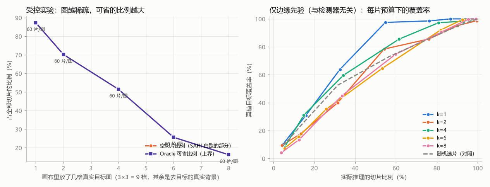

- **SAHI 的切片数在这五档里恒定 60.0 片/图**，与图里有没有东西完全无关——这正是 1.2 说的“代价只由尺寸决定”；
- 目标面积占比从 1.4% 升到 9.3%，**空切片比例从 87.3% 降到 16.2%**：稀疏场景的可省空间接近 8 成，密集场景只剩零头；
- 这条曲线解释了为什么 VisDrone（0.96 MP、空切片 7.1%）的收益远小于 DOTA（7.0 MP、空切片 82.1%）：**能省的比例 ≈ 空切片比例**，它是尺寸与稀疏度的函数；
- 右panel 给出与检测器无关的选片质量：4K 画布上约 55% 切片预算时，仅边缘先验仍覆盖 65%–98% 的真值目标，而同预算的随机选片只有约 70%（k=1、θ=0.6：97.5% vs 69.6%）——在真实 4K 尺度上，选片信号的排序能力依然成立。

**定位说明（避免误读）**：这是**受控实验**（自造画布 + 几何/图像先验，不含检测器），只用于验证机制，不能替代真实数据上的 AP 结论；主结论仍是 3.2–3.7。要在这些画布上出真实 AP，跑三行命令即可（见 README 的 sparse4k 段）：`prepare_data.py --dataset sparse4k` → `run_eval.py cache|sim --dataset sparse4k`。

### 3.11 细分指标：person / car / truck / bus

本文的评测类别是 person + vehicle 两个超类，好处是跨数据集可比（COCO 预训练模型只能对上这些类），代价是把 car、bus、truck 的差异合并掉了——三类难度并不相同，合并后信息量少了一半。`scripts/per_class.py` 保留细分口径：**GT 与检测同时映射到 4 个细分类别**，再按类别过滤重跑 COCOeval（两边口径一致才可比，而不是只改 GT）：

| 细分类别 | VisDrone 来源类别 | 检测器侧（COCO 0-based） |
|---|---|---|
| person | pedestrian(1) + people(2) | person(0) |
| car | car(4) + van(5) | car(2) |
| truck | truck(6) | truck(7) |
| bus | bus(9) | bus(5) |

80 张子集上的冒烟结果（只为验证脚本，不代表全量结论；AP50，顺序为 SAHI / Glance-SAHI / 同数量随机）：

| 类别 | SAHI | Glance-SAHI（θ=0.9） | 随机对照 |
|---|---|---|---|
| person | 0.4395 | 0.4349 | 0.4164 |
| car | 0.5714 | 0.5758 | 0.5296 |
| truck | 0.2724 | 0.3009 | 0.2621 |
| 四类平均 | 0.4201 | **0.4283** | 0.4097 |

两个可用的观察：**(a)** 大车比小轿车难得多（AP50 差约 0.27），说明“合并成 vehicle”确实掩盖了难度差异；**(b)** Glance-SAHI 在 car 与 truck 上略高于 SAHI，掉的是 person——与 3.2 的类别分析一致（person 更小，更可能被缩略图完全看漏）。注意样本极少的类别（如 bus）AP 波动很大，且 `pycocotools` 在“该类没有小目标真值”时会返回 AP_small = −1，读表时别当成 0。

### 3.12 把"序可靠"的 c 标定成"可当概率用"的 p̂（借鉴 SaccadeNet 的按混淆变量分箱）

**为什么改。** 2.2 已经承认一个洞：检测先验把粗检测置信度 c_j **直接当作** P(该处有目标|粗检测 j)，但"c_j 只在序关系上可靠（检测器未在缩略图尺度上标定）"。这不是措辞上的谦虚，是可以量出来的偏差——粗检测来自整图缩小推理（模型输入 640），同一张图里目标被下采样后越小、响应越弱；不同图的缩放比还不一样（VisDrone 实测 0.32–0.47×）。于是同一个 c 在不同图、不同目标尺度下的含义并不相同，S_det 名义上叫"后验概率"，实际上只是"一个单调分数"。后果是 4.4 里那条局限：θ 换场景要重标。

**改了什么**（新增 `glance_sahi/calibration.py`，不做任何训练、不改检测器）。借鉴 SaccadeNet 的"按混淆变量分箱后重新标定"（它用偏心率 e 分箱标定 d′(e)，见其报告"两个视野半径"一节），这里把混淆变量取成**粗检测框在模型输入尺度下的表观尺度**：

    t = scale · √(w·h),    scale = 640 / max(H, W)

这个量**完全可部署**——只用粗检测框，不需要真值。按 t 分箱（默认边界 [0,2,4,8,16,32,64,∞) 模型输入像素）后，在每个箱内用**保序回归**（PAVA，`calibration.py::pava`）拟合一条单调不减的映射 p̂ = f_b(c)，使 p̂ ≈ P(检测为真 | c, 箱 b)。样本不足 50 条的箱回退到全局映射，避免小箱过拟合。保序回归只要求"p̂ 随 c 单调不减"，不假设参数形式——正好匹配"c 的序关系可靠、绝对值不可靠"这一前提。

与原方法的同构与区别：SaccadeNet 按偏心率分箱标定每个候选的 log-odds，这一步同样是后处理（在开发集上拟合 d′(e)，不重新训练网络），但它标定的是自己网络的读数；我们只对**已经拿到的粗检测**做一次后处理，检测器、切片网格、NMS 全部不动，仍然保持"免训练、一行替换"的定位。

**实验协议（`scripts/calibrate.py`）。** 奇偶拆分：奇数序号 274 张拟合标定器（调参集），偶数序号 274 张做留出验证，与 3.8 的诊断协议一致。全程离线读 `results/cache.pkl`，不需要 GPU。拟合集共 29183 条粗检测，真阳率 0.640（标签定义：检测中心到同类别 GT 中心距离 ≤ max(半个 GT 框对角线, 6px)；落在 crowd/忽略区里的检测不参与拟合，避免脏标签）。

**结果一：先验概率真的变得可以当概率用（可靠性，留出集 28518 条）。** 标定前后各算一次 ECE（期望标定误差，15 箱）：

| | ECE | 含义（以留出集最大的那个概率箱为例） |
|---|---|---|
| 未标定 c | 0.5100 | 平均说 0.027、实际 0.535 是真的（`calib_reliability.csv` 第 0 箱） |
| 标定后 p̂ | **0.0304** | 预测概率与实际频率基本贴合对角线 |

即未标定分数在绝对概率意义上是错的（偏差 0.51），标定后偏差降到 0.03（下降 94.0%）。可靠性图见 `results/figures/fig9_calibration.png` 左 panel（该图由 `scripts/calibrate.py` 自动生成）。**声明一条边界**：ECE 的下降有一部分是"标定的目标就是这套标签定义"——它证明的是"p̂ 与这套中心匹配口径下的真阳率一致"，不等于"p̂ 就是绝对目标存在概率"。

**结果二：分箱映射长什么样**（`results/calibration.csv`，标定集）：

| 箱 | 表观尺度（模型输入 px） | 样本 | p̂(c=0.05) | p̂(c=0.10) | p̂(c=0.90) |
|---|---|---|---|---|---|
| 0 | [0, 2) | 0 | 全局回退 | 全局回退 | 全局回退 |
| 1 | [2, 4) | 2 | 全局回退 | 全局回退 | 全局回退 |
| 2 | [4, 8) | 1305 | 0.516 | 0.621 | 1.000 |
| 3 | [8, 16) | 13584 | 0.575 | 0.708 | 1.000 |
| 4 | [16, 32) | 11000 | 0.687 | 0.771 | 1.000 |
| 5 | [32, 64) | 2905 | 0.547 | 0.667 | 1.000 |
| 6 | [64, ∞) | 387 | 0.298 | 0.298 | 0.990 |

读法：**同一句"我很确定"在不同尺度上不是一个意思**。大目标的框（箱 6）要 c 很高才可信（p̂(c=0.9)=0.99，但 c=0.1 时只有 0.30）；小目标的弱响应（箱 3–4）可信度高得多（c=0.05 就有 0.58–0.69）。这就是"跨箱重排序"的来源，也是下面预算对照里收益的来源。

**结果三：同样切片预算下，标定后的排序更准（留出集，`results/calib_holdout.csv`）。** 阈值模式会掩盖标定的作用（见结果四），所以这里比的是**固定预算**——每张图跑分数最高的 x% 切片，和未标定、以及同预算随机对照比：

| 切片预算 | Glance 未标定 AP | Glance 标定后 AP | 随机对照 AP（3 种子） | 未标定小目标覆盖率 | 标定后覆盖率 |
|---|---|---|---|---|---|
| 50.2% | 0.2721 | **0.2819** | 0.2552 ± 0.001 | 84.7% | **95.0%** |
| 63.0% | 0.2777 | **0.2822** | 0.2649 | 91.3% | **96.4%** |
| 73.0% | 0.2813 | 0.2820 | 0.2731 | 94.2% | 97.3% |
| 76.8% | 0.2826 | 0.2821 | 0.2734 | 95.5% | 97.5% |
| 87.2% | 0.2845 | 0.2841 | 0.2806 | 98.9% | 99.6% |
| （SAHI 全切参照） | — | 100% 切片 AP = 0.2852 | — | 100% | 100% |

- **预算越紧，收益越大**：50% 预算时 AP +0.0098、小目标覆盖率 +10.3 个点；63% 时 AP +0.0045、覆盖率 +5.1 个点；到 77% 以上两者持平。
- **标定后在 50% 预算就拿到 SAHI 全切 AP 的 98.8%**（0.2819 / 0.2852），未标定只有 95.4%。
- 两个预算档上标定都仍严格优于同预算随机对照（50%：0.2819 vs 0.2552）。

**结果四（负结果，如实报告）：在阈值模式下，标定反而更保守、更不省。** 同一批留出图上：

| 工作点 | 切片比例 | AP | 小目标覆盖率 |
|---|---|---|---|
| 未标定 θ=0.9 | 79.2% | 0.2837 | 95.6% |
| 未标定 θ=0.99 | 62.9% | 0.2799 | 92.2% |
| 标定后 θ=0.99 | **91.1%** | 0.2853 | 98.5% |

原因是清楚的：密集场景里"弱检测是真的"的比例本来就高（箱 3–4 的 c=0.05 → p̂≈0.5–0.6），标定把 S_det 整体抬高后，θ 的可选区间被压缩到接近 1，几乎没有切片能被丢掉。所以：

1. **标定的正确用法是"固定预算排序"（`mode="budget"`），不是"概率阈值"（`mode="threshold"`）**——它的价值是"同样的算力预算下选得更准"，不是"提供一把绝对概率门槛"；
2. 2.2 里"θ 是后验概率阈值"的说法在标定之后**不再成立**：标定后的 p̂ 才是有概率含义的量，要用概率门槛就应该直接对 p̂ 取阈值，而不是再套一层相对 θ。这一条已补进 4.4。

**与主结果的关系（避免误读）。** 3.2–3.7 的主结果**不使用**标定，仍以默认 `noisyor` + θ 为准；本节是**同预算**工作点下的可选增强，用于回答"在更紧的算力预算下，能不能选得更准"。所有数字来自 `results/calibration.csv`、`results/calib_reliability.csv`、`results/calib_holdout.csv`、`results/calibrator.pkl` 与 `results/figures/fig9_calibration.png`，命令为 `python scripts/calibrate.py`（可复现，无需 GPU）。参照 SaccadeNet 的"按混淆变量分箱"思路，但只借机制、不借它的对数极坐标视网膜架构。

### 3.13 漏检归因：省下的是"没人要的"切片，选片的代价只有 0.6 个百分点

**为什么做。** 3.5 报了"小目标覆盖率 95.8%"，但覆盖率和"漏检"是两回事——它只说明目标**所在的切片有没有被选中**，没回答两个更要紧的问题：(a) 被丢掉的目标里有多少是**本来还检得出来**的（这才是选片的真实代价）；(b) 剩下的漏检该记在谁头上。3.6 的失败案例也只是定性地说"低对比度 + 远距离"。这一节把它拆成一张可数的账（`scripts/attribute.py`，纯离线读缓存，不需要 GPU）。

**怎么拆。** 对每个非 crowd 的评测目标，依次问三个问题：

1. 最终输出里有同类、且中心距离 ≤ max(半个 GT 对角线, 6px) 的框吗？→ **命中**；
2. 没有的话，**任意切片（含被丢弃的）**里有吗？→ 有就说明"本来检得出来"，这个漏检是**选片造成的**；
3. 若只在**被选中的**切片里有、却没进最终输出 → 被 NMS/阈值吃掉了，纯属白跑。

于是每个漏检归到三类：**检测器能力**（任何切片都检不出）、**选片代价**（只在丢弃的切片里能检出）、**选中却漏**（应接近 0，是自检项）。

**结果（VisDrone 全量，20620 个小目标 / 31009 个评测目标，`results/attribution.csv`）：**

小目标（< 32²）：

| 方法 | 命中 | 漏：检测器能力 | 漏：**选片代价** | 漏：选中却漏 |
|---|---|---|---|---|
| SAHI 全切（100% 切片） | 65.5% | 34.2% | — | 0.23% |
| Glance-SAHI θ=0.9（79% 切片） | 64.9% | 34.2% | **0.60%** | 0.24% |
| Glance-SAHI θ=0.99（63% 切片） | 63.6% | 34.2% | **1.90%** | 0.23% |

全部评测目标：

| 方法 | 命中 | 漏：检测器能力 | 漏：**选片代价** | 漏：选中却漏 |
|---|---|---|---|---|
| SAHI 全切 | 74.5% | 25.4% | — | 0.16% |
| Glance-SAHI θ=0.9 | 73.8% | 25.4% | 0.62% | 0.17% |
| Glance-SAHI θ=0.99 | 72.7% | 25.4% | 1.80% | 0.16% |

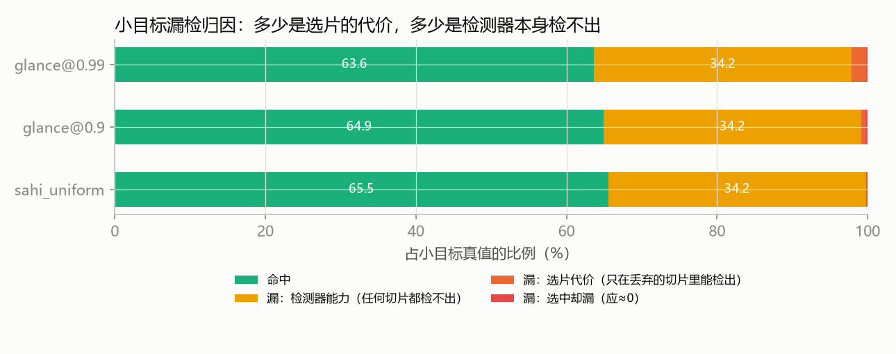

**三条结论：**

1. **漏检的大头不是选片造成的。** θ=0.9 时小目标总漏检 35.0 个点，其中 **34.2 个点（占 98%）是"任何切片都检不出"**，属于零训练 COCO 检测器的能力上限；选片只贡献 0.60 个点。激进档 θ=0.99 把切片砍到 63%，代价也只从 0.60 升到 1.90 个点。换句话说：**用 21% 的切片省换 0.6 个点的漏检**。
2. **这条账把 4.4 的"绝对精度受检测器限制"从一句话变成了定量结论**：选片策略的优化上限本来就很小（≤0.6 个点），真正该投入的是换一个在航拍数据上微调过的检测器（对应 4.5 第一条后续）。这也解释了为什么 3.7 的 DOTA 实验里选片怎么调都救不回 AP——检测器不认识那类场景，而 82% 的漏检责任在检测器。
3. **自检通过**：三种方法的"漏：检测器能力"逐位相同（34.2% / 25.4%）——这个量按定义就与选片策略无关，相同说明分解没串味；"选中却漏"在三种方法下都是 0.16–0.24%，与 SAHI 持平，说明我们的合并路径（只改选片）没有额外吃掉任何检测。

**口径提醒**：这里的"命中"是"存在一个中心匹配的检测框"（recall@center-match），与 3.2 的 COCO AP 不是同一个量，不能直接互比；两者互补——AP 关心排序与精度，这一节关心"漏在哪、该谁负责"。

### 3.14 主动式两轮选片 + 可计算的停机判据 E（一个负结果和一个正结果）

**为什么改。** 到此为止选片都是**一次性**的：先验分数算完就定了，跑出什么结果都不影响后面的决策。SaccadeNet 的注视循环是"边看边决定"——每一眼的观测都更新信念，再决定下一眼看哪。这一节把那个循环压成**两轮**，只借用"决策依赖观测"这一核心机制（不借用它的对数极坐标视网膜架构。SaccadeNet 在做完决策逐位不变的性能重构后，仍比强两阶段慢 1.8–2.8 倍；8K 以上的差距主要来自"目标位置无先验"时多出来的探索眼，而不是视网膜采样本身）：第 1 轮按标定后的分数跑最靠前的 x% 片；第 2 轮把第 1 轮的**实测结果**扩散成新证据——某片检出非空说明该区域目标成簇、邻居值得复核（正证据），某片被选中却检空说明那里只是粗检的假象（负证据）——再在剩余切片里追加 top-m 片。

**公平对照的设计。** 第 1 轮 x% + 第 2 轮追加的片数，**正好等于**一次性选片跑同样多的片数（按图逐张对齐片数，而不是按比例——按比例会因 `round()` 系统性少跑）。于是问题变成：第 2 轮用观测挑出来的片，是不是比"盲选下一批"更好？

**结果（留出集偶数 274 张，曲线见 `results/figures/fig11_active.png`）：**

| 方法 | 切片比例 | AP | AP_small | 小目标覆盖率 |
|---|---|---|---|---|
| 整图直接推理 | 0% | 0.2014 | 0.0961 | — |
| **两轮主动**（x=60%，余量 15%） | 75.7% | **0.2826** | 0.1802 | 97.3% |
| **一次性，每图同数量** | 75.7% | **0.2821** | 0.1800 | 97.4% |
| 随机，每图同数量（3 种子） | 75.7% | 0.2725 ± 0.001 | 0.1689 | 89.9% |
| 一次性（标定后）@73% | 73.0% | 0.2820 | 0.1799 | 97.3% |
| 随机 @73% | 73.0% | 0.2731 | 0.1686 | 89.9% |
| **E 停机 ε=1.0**（每图自适应） | **82.6%** | **0.2845** | 0.1810 | 98.7% |
| 一次性 @86.7% | 86.7% | 0.2841 | 0.1808 | 99.6% |
| 两轮主动（x=80%，余量 15%） | 89.1% | 0.2846 | 0.1812 | 99.5% |
| 一次性 @99.5% | 99.5% | 0.2852 | 0.1811 | 100% |
| SAHI 全切 | 100% | 0.2852 | 0.1811 | 100% |

**判定一（负结果，如实报告）：主动式第 2 轮没有可测收益。** 在同为 75.7% 切片的严格对照下，主动 0.2826 vs 一次性 0.2821（**+0.0005**），覆盖率 97.3% vs 97.4%（**−0.1 个点**）——都在随机对照的种子标准差（±0.001）以内。这与 3.13 的归因一致：选片的代价上限本来就只有 0.6 个百分点，第 2 轮能捞回的只会更少，**在 VisDrone 这种密集城市航拍场景里，"多看一眼"没有空间**。

**判定二（正结果之一）：观测驱动显著优于同预算盲选。** 同为 75.7% 切片，主动 0.2826 vs 随机 0.2725 ± 0.001（**+0.010 AP**），小目标覆盖率 97.3% vs 89.9%（**+7.4 个点**）。注意这个优势继承自先验排序，不是第 2 轮带来的——它说明的是"按内容选片"本身有效（与 3.3 的随机对照同源）。

**判定三（正结果之二）：E 停机是把曲线往上推的那个部件。** 标定之后每片的 S_det(k) 就是"这片含目标"的后验概率，于是

    E = Σ_{k ∉ 已跑} S_det(k)

是"还没看的地方预期漏掉多少个目标"——不需要真值、可跨图比的绝对量。用它做停机判据（按分数从高到低追加，直到 E ≤ ε）：

- ε=1.0 → **82.6% 切片、AP 0.2845**；同预算（82.6%）下的一次性/主动约为 0.2832–0.2833，差约 +0.0013。**这个差不能当作"E 停机更好"的证据**：同预算的对照值是由相邻预算点插值得到的，不是实跑；差值没有配对区间，量级与随机对照的种子噪声（±0.001）相当；ε 也是在留出集上选的。能说的只是"E 停机在这个工作点上不比一次性选片差"；
- ε=5.0 → **32.7% 切片、AP 0.2729**（比 50.2% 预算的随机对照 0.2552 高 0.018，但低于 50.2% 的一次性 0.2819）。
- 它给出的是**每图自适应**的预算：目标稀疏的图早停、目标密集的图多跑，判据是概率量而不是固定比例。

**判定四（对 E 本身的边界，如实标注）：E 不是校准过的"期望漏检数"。** 在留出集上把 E 与 3.13 定义的"选片代价"逐图对照：秩相关只有 **0.27–0.34**（弱正相关），且 E 系统性高估约 **2.5 倍**（Σ E = 500.6 vs 实际代价 188；主动式 442.3 vs 180）。原因是两者定义不同——S_det 是"这片含目标"的后验，而实际代价只统计"能检出且恰好只在被丢弃切片里"的目标。所以准确的表述是：**E 可以作为单调、可跨图比的停机旋钮（有实证工作点支持），但不能读成"期望漏掉 N 个目标"。** 另外当 ε ≥ 20 时判据退化（每图只跑 1 片），说明 E 的自然尺度是**每图 1–5**。

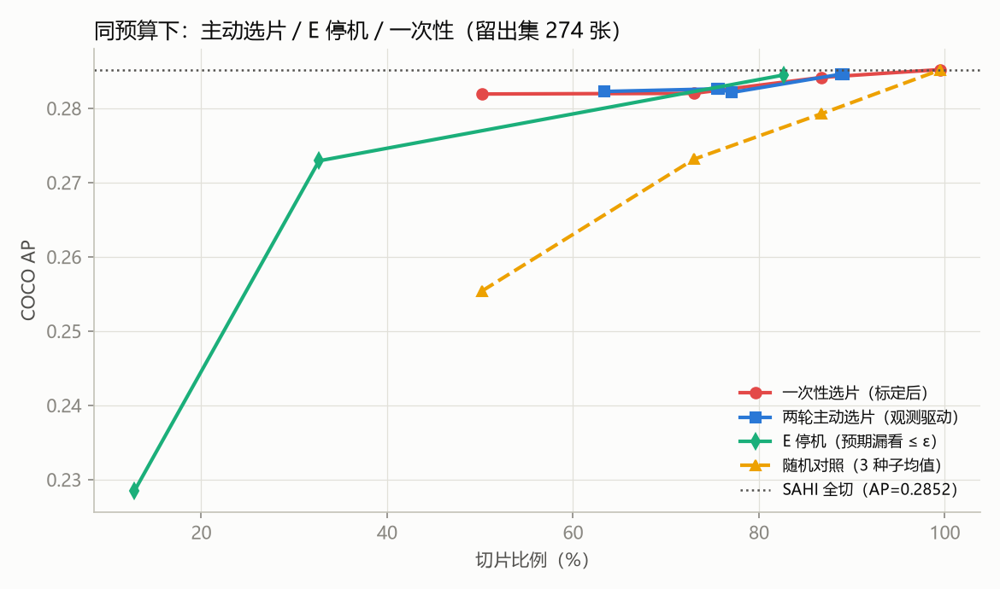

**价值与边界。** 这一节交付的不是"更准"，而是**一个新的、可计算的选片旋钮**：预算该由图像内容决定（E 判据）而不是固定比例，且判据是概率量、能跨图统一。它同时给出一个可检验的判断——**什么时候值得"主动再看一眼"**：当某张图的 E 明显偏大（未看区域的累计后验高）时才需要追加切片；而本例中 E 与真实代价的比值约 2.5，说明先验系统性偏悲观，第二轮"多看一眼"因此在密集场景里没有回报。

**口径与边界**：曲线上的点是扫出来的一族工作点（与 3.2 的 θ 扫描同理），不是挑出来最好看的一个；参数网格为 x∈{0.6,0.8}、余量∈{0.05,0.15}、θ₂∈{0.5,0.7}，扩散尺度 σ=600px、强度 γ=0.5。全程离线读 `results/cache.pkl`（"跑第 k 片"= 读缓存），因此"决策依赖观测"可以精确复现，不需要 GPU。新增模块 `glance_sahi/active.py`，评测脚本 `scripts/active_eval.py`。

### 3.15 可学习稀疏路由器：把"有没有目标"换成"跑这片有没有增量"

**为什么改。** 手工稀疏门 S = 1 − (1 − S_det)(1 − λ·S_img) 的形式、λ 和 θ 都是人定的，而且它估计的是"片里有没有目标"。真正该估计的是**"跑这片检测器能不能多检出扫视没检出的目标"**——整图一眼已经看清的大目标，再切一次是白花算力。3.13 的归因已经说明选片代价上限很小，所以这里要回答的是：**在更紧的预算下（30%–50% 切片），能不能少掉点。**

**改了什么。** 选片写成稀疏路由 z_k = 1[g_φ(x_k) ≥ μ]：

- 输入 x_k：每片 22 维扫视特征（`glance_sahi/router.py::slice_features`），全部来自已有的一眼扫视和缩略图边缘，**不增加检测器调用**：三种检测先验、片内弱框/强框数、表观尺度、边缘先验、8 邻域证据、切片位置与面积等；
- 标签：该片是否检出了扫视没检出的真值（gain）；对照标签 = "片内有没有真值"（gt）；
- 模型：逻辑回归 / 小 MLP，损失 BCE + α·平均激活（L1 稀疏），5 种子集成，推理只用 numpy（`results/router.json`）；
- 协议：奇数序号 274 张训练（其内按图分组 5 折交叉验证选宽度与 α），偶数序号 274 张留出评测，与 3.12 同一划分；另按视频序列划分复查相邻帧泄漏（`--split sequence`）；
- 阈值 μ 全部在训练图上定：默认工作点 μ 让训练集激活率等于手工门 θ=0.9 的切片比例，半预算点取训练集 50% 分位。

**结果（留出集 274 张，`results/router_*.csv`，图 `fig12_router.png`、`fig14_router_sparsity.png`）：**

切片级排序质量（标签 = gain）：

| 打分 | ROC-AUC | PR-AUC | ECE |
|---|---|---|---|
| 手工稀疏门（det + edge 融合） | 0.728 | 0.758 | 0.319 |
| 仅检测先验 noisy-OR | 0.727 | 0.758 | 0.300 |
| **可学习路由** | **0.866** | **0.899** | **0.055** |
| 可学习路由，标签换成"有无目标"（消融） | 0.619 | 0.613 | 0.157 |

同预算端到端（AP / AP_small，%）：

| 切片比例 | 手工门 top-k | 路由 每图 top-k | 路由 全局阈值 | 随机（3 种子） | SAHI 全切 |
|---|---|---|---|---|---|
| ≈27% | 25.16 / 15.53 | 26.45 / 17.35 | 27.42 / 18.20（29.0%） | 23.32 / 13.13 | 28.52 / 18.11 |
| ≈50% | 27.21 / 17.01 | 28.16 / 18.48 | **28.54 / 18.54**（50.1%） | 25.54 / 15.19 | 同上 |
| ≈79%（θ=0.9 配对） | 28.37 / 17.97 | 28.38 / 18.04（同每图 k） | **28.60 / 18.10**（79.0%） | 27.75 / 17.35 | 同上 |

判定：

1. **排序明显更好**：PR-AUC 0.758 → 0.899，ECE 0.32 → 0.06（门控输出基本可以当概率读）。按视频序列划分也成立（PR-AUC 0.746 → 0.865），不是相邻帧泄漏造成的。
2. **收益集中在紧预算**：79% 预算下路由和手工门逐图同 k 时只差 0.01 个百分点；到 50% 预算，路由全局阈值 28.54 对手工门 27.21，已经追平 SAHI 全切（配对区间见 3.16）。序列划分下同样：50% 预算 top-k 28.91 vs 手工门 27.91 vs 随机 26.39。
3. **起作用的是"全局阈值 + 增量标签"，不是 L1 稀疏**：同为约 50% 切片，全局阈值（28.54）比每图 top-k（28.16）好——全局阈值让空图少跑、密图多跑（每图激活率与目标数的秩相关 0.40，手工门 0.30；≤10 个目标的图平均只激活 30%，手工门 46%）。标签换成"有无目标"后比随机还差（26.5% 预算时 22.30 vs 23.32），说明学"增量"才是关键。反过来，交叉验证选出的是**线性模型、α=0**，α=1 的强稀疏正则几乎不改变门控分布（均值 0.57 → 0.55），**L1 稀疏项在本数据上没有贡献**，稀疏性全部来自阈值 μ。
4. **最重要的特征**（置换重要性，PR-AUC 下降）：片内框的表观尺度 0.065、弱框数 0.030、纵向位置 0.015、强框数 0.014、4p(1−p) 不确定性 0.011。含义直观：**框小、弱框多的片**才是"切开放大会多检出东西"的片；纵向位置反映无人机俯视的透视——画面上方更远、目标更小。

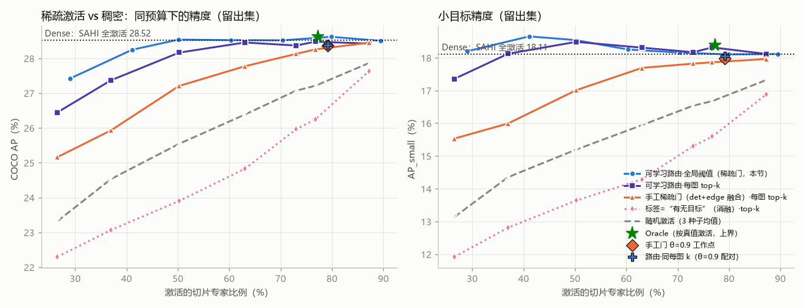
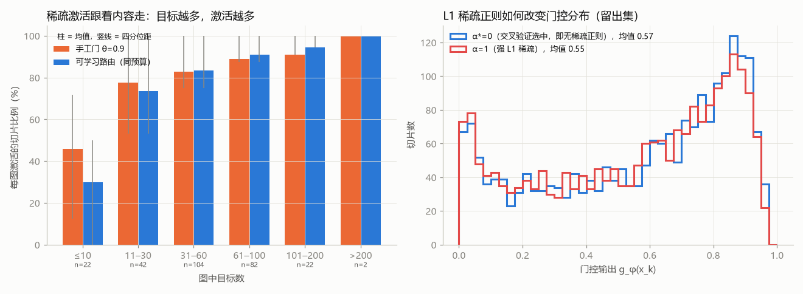

**口径与边界**：路由器有 23 个参数，训练 1 秒（CPU），但需要一份带标注的训练图，换检测器或换数据集要重新训练（特征来自该检测器的扫视输出）；DOTA 上还没做。离线 ms/图不含路由打分本身；Demo 实测 1080p 单图特征 + 打分约 17–25 ms，比手工门（11–15 ms）多 5–10 ms，约为半个切片的推理时间（1080p 图上一个切片约 20–25 ms，RTX 3050）。命令：`scripts/train_router.py`（奇偶划分）、`scripts/train_router.py --split sequence --tag _seq --no-ablations`（序列划分，输出 `*_seq.*`）。

### 3.16 配对 bootstrap：差异是否显著

前面各节的 AP 差很多只有零点几个点，需要判断它们是不是噪声。做法：在图像层面有放回重采样 1000 次，每次所有方法**用同一组图**重算 COCO AP（`glance_sahi/evalboot.py` 缓存了逐图匹配结果，与 pycocotools 数值一致，`tests/test_bootstrap.py`），对差值取 2.5%/97.5% 分位。留出集 274 张（含路由，路由只在奇数图上训练）；全集 548 张只比零训练方法。

| 对比（留出集，ΔAP 百分点 [95% 区间]） | 切片比例 | ΔAP | ΔAP_small |
|---|---|---|---|
| 手工门 θ=0.9 − SAHI | 79.2% | −0.15 [−0.30, −0.03] | −0.14 [−0.24, +0.02] |
| 手工门 θ=0.9 − 随机同 k | 79.2% | **+0.62** [+0.37, +0.85] | **+0.62** [+0.35, +0.94] |
| 路由 全局阈值 − SAHI | 79.0% | +0.08 [−0.09, +0.25] | −0.02 [−0.13, +0.10] |
| 路由 全局阈值 − 手工门 θ=0.9 | 79.0% | **+0.23** [+0.10, +0.40] | +0.12 [−0.01, +0.21] |
| 路由 50% 预算 − SAHI | 50.1% | +0.02 [−0.26, +0.37] | **+0.43** [+0.19, +0.77] |
| 路由 50% 预算 − 手工门 top-50% | 50.1% | **+1.33** [+0.98, +1.90] | **+1.53** [+0.92, +2.07] |
| 路由 50% 预算 − 随机 50% | 50.1% | **+2.70** [+2.32, +3.13] | **+2.95** [+2.45, +3.55] |
| 全集 548 张：手工门 θ=0.9 − SAHI | 79.0% | −0.12 [−0.25, −0.05] | −0.13 [−0.21, −0.03] |
| 全集 548 张：手工门 θ=0.9 − 随机同 k | 79.0% | **+0.69** [+0.57, +0.90] | **+0.79** [+0.60, +1.01] |

判定：

- **手工门比 SAHI 少 0.12–0.15 个点，这个差是真的**（区间不含 0），但很小；它比随机好 0.6–0.7 个点，也是真的。3.2 的"AP 只掉 0.13"应读成"显著但很小的损失"，而不是"没有损失"。
- **可学习路由在 79% 切片时与 SAHI 无法区分**（区间跨 0），并且显著好于手工门。
- **最有用的一行：路由只跑一半切片时，AP 与 SAHI 无法区分，AP_small 反而显著高 0.43 个点。** 一种解释是被跳过的片里 SAHI 只贡献小框误检（与 3.7 DOTA 上"少切反而略升"同一现象）；这一点只在留出集 274 张上验证过，没有在别的数据集上复现，不应外推。

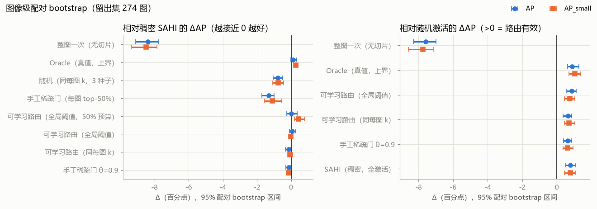

**口径与边界**：bootstrap 只刻画"换一批同分布的图"带来的波动，不包括检测器、切片网格或数据集变化；50% 预算点的 μ 取自训练图，留出集上的实际比例是 50.1%，没有按留出集回调。命令：`scripts/bootstrap_ci.py`（留出集）、`scripts/bootstrap_ci.py --scope all`（全集）；只重画图用 `--replot`。

---

## 4. 有什么价值

### 4.1 优化前后一览

| | SAHI（优化前） | Glance-SAHI（优化后） |
|---|---|---|
| 切片数由什么决定 | 只由图像尺寸决定，N ≈ ⌈W/410⌉·⌈H/410⌉ | 由“可疑区域”决定，k ≤ N，逐图自适应 |
| 空图 / 空区域 | 照切照跑 | 跳过（VisDrone 22 张图一片不切；DOTA 跳过跑道、草地、水面） |
| 额外开销 | — | 检测先验 < 0.1 ms/图；边缘先验 10–36 ms/图（CPU，≈ 1 个切片的推理时间） |
| 检测器与训练 | — | 不变，零训练，黑盒可用 |
| 接口 | `get_sliced_prediction` | `glance_sliced_prediction`，返回同样的 `PredictionResult`；θ=0 时与 SAHI 逐位一致 |

### 4.2 实测收益（同一检测器、同一切片网格、同一后处理）

| 场景 | 工作点 | 切片减少 | 提速 | 精度变化 |
|---|---|---|---|---|
| VisDrone 城市航拍（密集，平均 57 目标/图） | θ=0.9 默认 | −21% | +12%（端到端，4.33 → 4.91 FPS） | AP −0.13，AP_small −0.13 |
| 同上 | θ=0.99 激进 | −37% | +31%（离线计时） | AP −0.50，AP_small −0.42 |
| 同上 | 仅检测先验 θ=0.99 | −39% | +38%（离线计时） | AP −0.58，AP_small −0.49 |
| 同上（留出 274 张） | 可学习路由，50% 预算（3.15） | −50% | 约 +44%（离线 198.5 → 117.5 ms/图，再计入约 20 ms 路由打分） | AP +0.02 [−0.26, +0.37]，AP_small +0.43 [+0.19, +0.77]（3.16） |
| DOTA 大幅面遥感（平均 44.7 片/图） | 仅边缘先验 θ=0.5 | −42% | +35%（1297 → 837 ms/图，离线计时） | AP 2.53 → 2.61（未下降），目标覆盖率 95.5% |

同样的切片预算下，Glance 选片始终优于随机选片：VisDrone 上保住了 SAHI 小目标增益的 98.5%，随机只有 89.3%；DOTA 上目标覆盖率比随机高 9–13 个点。这说明省下来的主要是空切片，而不是靠运气。

### 4.3 应用价值

- **边缘设备 / 无人机机载实时巡检**：检测器调用次数是端侧延迟和功耗的主项。砍掉空切片，可以直接换成帧率或续航。在 VisDrone 上，默认工作点把 4.33 FPS 提到 4.91 FPS，而且精度几乎不变。
- **同样算力处理更大的图**：SAHI 的成本随像素面积线性增长；Glance-SAHI 的成本随“可疑区域面积”增长。实测中，空切片比例从 VisDrone（0.96 MP）的 7.1% 升到 DOTA（7.0 MP）的 82.1%，能省掉的切片比例也从约 21% 升到约 42%；4K 受控实验（3.10）进一步给出：目标只占 1.4% 面积时，87.3% 的切片是空的。图越大、画面越空，省得越多；Oracle 上界显示 DOTA 上最多可省 82%。
- **零迁移成本**：不训练、不改模型，已有的 SAHI 流水线只需换一个函数。θ（或绝对量 τ）控制速度与精度的取舍。烟头、火点、违停等场景只需换检测器，选片逻辑不变。
- **业务闭环可以接上（违停示范）**：选片解决“看得见”，业务层还要“判得出”。`glance_sahi/rules.py` + `scripts/illegal_parking.py` 给出一个量级很小的示范：取车辆框的**着地点**（底边中点，比框中心更接近车辆真实地面位置），用 `cv2.pointPolygonTest` 判断它是否落在禁停多边形内，命中就输出带禁停区与着地点的标注图。规则层与选片解耦——少切了哪一片只影响“有没有检出这辆车”，不影响怎么判。**局限如实标注**：静帧只能判“车停在禁停区”，真正的违停还需要停留时长（dwell-time），视频里要配跟踪，连续 N 帧同一辆车落在同一禁停区且位移小于阈值才告警。同一套规则层可以套到越界、闯入、火点区域等场景（换多边形与目标类别即可）。

### 4.4 局限（如实列出）

- **检测先验依赖检测器“认得”这类场景**：在 DOTA 上，COCO 模型几乎认不出俯视目标，检测先验随之失效（θ=0.3 时只覆盖 14.5% 的目标）。此时必须把图像先验权重 λ 调到约 1.0，或只用图像先验。换场景、换检测器时，需要用少量标注图标定一次 λ 和 θ。
- **盲区**：缩小后完全看不见、纹理又和背景相近的极小目标，两路证据都给不出信号，会被漏掉（见 3.6 失败案例）。
- **密集场景省得少**：目标遍布全图时会退化成 SAHI 全切，还多付出一点打分开销（VisDrone 中 312/548 张全切）。
- **标定只在"固定预算"下有效，且没有概率门槛**：3.12 把 c 标定成可当概率用的 p̂（ECE 0.51→0.03、同预算排序更优），但标定后的分数在密集场景里整体饱和，**阈值模式反而更不省**（θ=0.99 时 91.1% vs 未标定 62.9%）；同时 2.2 里"θ 是后验概率阈值"的说法在标定之后不再成立——标定只提供"更准的排序"，不提供"可扫的绝对门槛"。标定器还需要一份留出集来拟合（本节用奇数 274 张），换数据集要重新标定一次；DOTA 上尚未做。
- **主动式第 2 轮在 VisDrone 上没有收益**：3.14 的严格同预算对照下，两轮主动 vs 一次性仅差 +0.0005 AP（在随机对照 ±0.001 的种子噪声内）。这是 3.13 的直接推论——选片代价上限只有 0.6 个点，没有留给"多看一眼"的空间。因此主动机制的可用部分不是"提精度"，而是 E 停机判据（每图自适应预算）。
- **E 只是停机旋钮，不是校准过的期望漏检数**：3.14 里 E = Σ_{未跑} S_det 与实际选片代价的逐图秩相关只有 0.27–0.34，且系统性高估约 2.5 倍（Σ E = 500.6 vs 实际 188），ε ≥ 20 时判据还会退化（每图只跑 1 片）。可以拿它做单调、可跨图比的预算开关，不能读成"期望漏掉 N 个目标"。
- **绝对精度受检测器限制**：本报告全部使用 COCO 预训练模型、零训练，DOTA 上绝对 AP 很低。结论针对的是“同一检测器下，选片前后的相对变化”。
- **4p(1−p) 变体还没有双数据集完整曲线**：本文主结果覆盖的是默认的 `noisyor`；`uncertain` / `max` / `heatmap` 三个变体与 τ 都已接进 `run_eval.py sim`（离线，只读 `results/cache.pkl`，不需要 GPU），完整曲线与 `fig6_det_weights.png` 需要重跑一次 `sim` + `make_figures.py` 才生成。3.9 里的新变体数字是前 100 张的冒烟结果，3.8 表 2 的 v0/v1 对比来自参照实现，两者都不能直接当作本实现在全量上的消融结论。
- **切片批推理未做**：SAHI 0.12.7 的 ultralytics 封装是单张推理，绕过它打 batch 会破坏“除选片外与官方 `get_sliced_prediction` 逐位一致”的承诺（3.2 的自检依赖这一点），所以留作后续工作。横向比耗时还要注意精度口径：参考实现开了 FP16，两边不同开就不是同一把尺子。
- **受控实验不含检测器**：3.10 的 4K 结论是“几何 + 图像先验”的机制验证；画布已经落盘（`--dataset sparse4k`），但在上面跑真实 AP 还没做。
- **细分指标的样本量**：3.11 的 truck / bus 真值数很少、AP 波动大，且 `pycocotools` 对“没有小目标真值”的类别返回 AP_small = −1，不宜单独引用。

### 4.5 后续

- 换用在 VisDrone / DOTA 上微调过的检测器做扫视，让检测先验在遥感图上重新生效，逼近 Oracle 的 17.9%。
- 把 3.12 的标定推广到 DOTA（检测器在那里几乎认不出目标，标定器要按"图像先验"而不是"检测表观尺度"分箱），并接进 `run_eval.py` 的 `ABLATIONS`/`sim`，出一张与 `fig6_det_weights.png` 同格式的标定消融曲线；同时把"固定预算 vs 阈值"两种用法并列进主表。
- 把 3.14 的 E 判据与 3.12 的标定合成一个统一旋钮：先用标定把 S_det 变成可解释的绝对量，再用 E ≤ ε 决定每图预算（本节的 E 高估约 2.5 倍，需要先用"仅在被丢弃切片里可检出"的目标数重新定义标定目标，才能读成期望漏检数）；同时把这个判据放到 DOTA 上试——那里可省空间从 42% 到 Oracle 82% 还很大，是按内容定预算更可能有回报的场景。
- 可学习路由（3.15）已经在 VisDrone 上做完；下一步是在 DOTA 和微调检测器上重训一次，看"50% 预算不掉点"能否复现，并把路由打分的 20 ms 压下来（特征里 4 种检测先验有重复计算）。
- 视频流中复用上一帧的选片结果（目标位置在帧间是连续的），并在业务层加 dwell-time 判定（4.3 的违停示范）。
- 借鉴 UFPMP-Det，把选中的切片拼图或打成 batch，进一步提高 GPU 利用率（需先解决 4.4 里“与官方 SAHI 逐位一致”的取舍）。
- 把 3.10 的稀疏画布与 3.11 的细分指标补齐到全量：`run_eval.py cache/sim/buckets --dataset sparse4k` 拿到 4K 上的真实 AP，`per_class.py` 在全量 548 张上报四类 AP。

---

## 参考

1. Akyon, F. C., Altinuc, S. O., & Temizel, A. (2022). Slicing Aided Hyper Inference and Fine-tuning for Small Object Detection. *ICIP*. https://github.com/obss/sahi
2. Zhang, H., et al. (2023). Adaptive Slicing-Aided Hyper Inference for Small Object Detection in High-Resolution Remote Sensing Images. *Remote Sensing* 15(5):1249. https://doi.org/10.3390/rs15051249
3. Yang, F., Fan, H., Chu, P., Blasch, E., & Ling, H. (2019). Clustered Object Detection in Aerial Images. *ICCV*. https://github.com/fyangneil/Clustered-Object-Detection-in-Aerial-Image
4. Li, C., Yang, T., Zhu, S., Chen, C., & Guan, S. (2020). Density Map Guided Object Detection in Aerial Images. *CVPR Workshops*. https://github.com/Cli98/DMNet
5. Deng, S., et al. (2021). A Global-Local Self-Adaptive Network for Drone-View Object Detection (GLSAN). *IEEE TIP*. https://github.com/dengsutao/glsan
6. Yang, C., Huang, Z., & Wang, N. (2022). QueryDet: Cascaded Sparse Query for Accelerating High-Resolution Small Object Detection. *CVPR*. https://github.com/ChenhongyiYang/QueryDet-PyTorch
7. Huang, Y., Chen, J., & Huang, D. (2022). UFPMP-Det: Toward Accurate and Efficient Object Detection on Drone Imagery. *AAAI*. https://github.com/PuAnysh/UFPMP-Det
8. Meethal, A., Granger, E., & Pedersoli, M. (2023). Cascaded Zoom-in Detector for High Resolution Aerial Images (CZDet). *CVPR Workshops*. https://github.com/akhilpm/DroneDetectron2
9. Liu, C., et al. (2024). YOLC: You Only Look Clusters for Tiny Object Detection in Aerial Images. *IEEE TITS*. https://github.com/dawn-ech/YOLC
10. Liu, K., et al. (2024). ESOD: Efficient Small Object Detection on High-Resolution Images. *IEEE TIP*. arXiv:2407.16424. https://github.com/alibaba/esod
11. Muzammul, M., et al. (2025). Guided Object Inference Slicing (GOIS). *Neurocomputing*. https://github.com/MMUZAMMUL/GOIS ，https://www.sciencedirect.com/science/article/abs/pii/S0925231225009993
12. ROI-Gated SAHI (2026). arXiv:2608.23923. https://arxiv.org/abs/2608.23923
13. Hou, X., & Zhang, L. (2007). Saliency Detection: A Spectral Residual Approach. *CVPR*.
14. Zhu, P., et al. (2021). Detection and Tracking Meet Drones Challenge (VisDrone). *IEEE TPAMI*. https://github.com/VisDrone/VisDrone-Dataset
15. Xia, G.-S., et al. (2018). DOTA: A Large-scale Dataset for Object Detection in Aerial Images. *CVPR*. https://captain-whu.github.io/DOTA/ ；转换版：https://docs.ultralytics.com/datasets/obb/dota-v2/
16. Jocher, G., et al. Ultralytics YOLO11. https://github.com/ultralytics/ultralytics
17. Najemnik, J., & Geisler, W. S. (2005). Optimal eye movement strategies in visual search. *Nature*.
